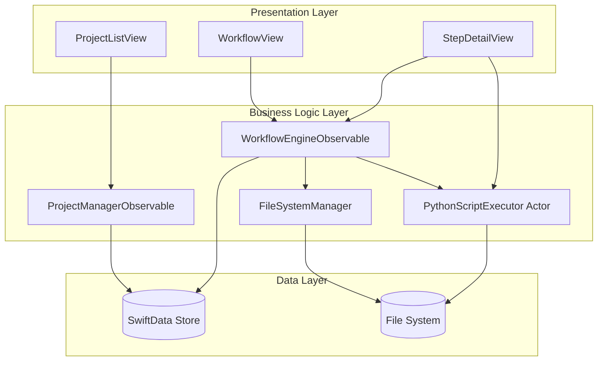

# Design Document: AI Forge Workflow Application

## Overview

AI Forge is a macOS SwiftUI application that provides a guided workflow interface for fine-tuning AI models across any knowledge domain. The application follows modern SwiftUI architecture patterns with `@Observable` classes for state management and SwiftData for persistence, leveraging native macOS capabilities for process execution and file management.

The system is organized into three primary layers:
1. **Data Layer**: SwiftData models for persistence and state management
2. **Business Logic Layer**: Observable classes and service classes that orchestrate workflow operations
3. **Presentation Layer**: SwiftUI views that provide the user interface

The application integrates with external Python scripts through Foundation's Process API, managing the complete lifecycle of fine-tuning workflows from source file preparation through model deployment.

**Technology Stack:**
- **UI Framework**: SwiftUI (macOS 14.0+)
- **State Management**: `@Observable` macro for reactive state
- **Persistence**: SwiftData with `@Model` macro
- **Navigation**: `NavigationStack` and `NavigationSplitView`
- **Process Execution**: Foundation Process API
- **File Management**: FileManager
- **Concurrency**: Swift async/await and actors
- **Serialization**: Codable for configuration files

## Architecture

### High-Level Architecture



### Component Responsibilities

**Presentation Layer:**
- **ProjectListView**: Displays all projects using `NavigationSplitView`, handles project selection, creation, and deletion
- **WorkflowView**: Shows the six workflow steps with progress indicators using `NavigationStack`
- **StepDetailView**: Displays step-specific UI and actions for the current workflow step

**Business Logic Layer:**
- **ProjectManagerObservable**: `@Observable` class that manages project CRUD operations and coordinates with SwiftData
- **WorkflowEngineObservable**: `@Observable` class that controls workflow step progression, validation, and state transitions
- **PythonScriptExecutor**: Actor that executes Python scripts and captures output streams (thread-safe)
- **FileSystemManager**: Manages project directory structure and file operations

**Data Layer:**
- **SwiftData Store**: Persists project data, configuration, and workflow state using `@Model` classes
- **File System**: Stores source files, generated datasets, model checkpoints, and configuration files

### Project Structure

Following the recommended architecture from Instructions.md:

```
AIForge/
├── App/
│   └── AIForgeApp.swift
├── Views/
│   ├── Projects/
│   │   ├── ProjectListView.swift
│   │   ├── ProjectCreationView.swift
│   │   └── ProjectManagerObservable.swift
│   ├── Workflow/
│   │   ├── WorkflowView.swift
│   │   ├── WorkflowEngineObservable.swift
│   │   ├── StepDetailView.swift
│   │   └── StepDetailObservable.swift
│   └── Configuration/
│       ├── ConfigurationView.swift
│       └── ConfigurationObservable.swift
├── Shared/
│   ├── Models/
│   │   ├── ProjectModel.swift
│   │   ├── WorkflowStepModel.swift
│   │   ├── FineTuningConfigurationModel.swift
│   │   └── SourceFileReference.swift
│   ├── Services/
│   │   ├── PythonScriptExecutor.swift
│   │   └── FileSystemManager.swift
│   ├── Extensions/
│   │   └── FileManager+Extensions.swift
│   └── Tools/
│       └── ValidationHelpers.swift
├── Resources/
│   └── Assets.xcassets
└── Supporting Files/
    └── Info.plist
```

## User Interface Components

### Main Application Structure

```swift
// Copyright ©2026 Big Mountain Studio. All rights reserved. X: @BigMtnStudio

import SwiftUI
import SwiftData

@main
struct AIForgeApp: App {
    var body: some Scene {
        WindowGroup {
            ContentView()
        }
        .modelContainer(for: [ProjectModel.self, WorkflowStepModel.self, FineTuningConfigurationModel.self])
    }
}
```

### ContentView (Main Layout)

```swift
// Copyright ©2026 Big Mountain Studio. All rights reserved. X: @BigMtnStudio

import SwiftUI
import SwiftData

struct ContentView: View {
    @Environment(\.modelContext) private var modelContext
    @State private var projectManager: ProjectManagerObservable?
    @State private var selectedProject: ProjectModel?
    
    var body: some View {
        NavigationSplitView {
            ProjectListView(
                projectManager: projectManager ?? createProjectManager(),
                selectedProject: $selectedProject
            )
        } detail: {
            if let project = selectedProject {
                WorkflowView(project: project)
            } else {
                Text("Select a project to begin")
                    .foregroundStyle(.secondary)
            }
        }
        .onAppear {
            if projectManager == nil {
                projectManager = createProjectManager()
            }
        }
    }
    
    private func createProjectManager() -> ProjectManagerObservable {
        let fileSystemManager = FileSystemManager()
        return ProjectManagerObservable(modelContext: modelContext, fileSystemManager: fileSystemManager)
    }
}

#Preview {
    ContentView()
        .modelContainer(ProjectModel.preview)
}
```

### ProjectListView

```swift
// Copyright ©2026 Big Mountain Studio. All rights reserved. X: @BigMtnStudio

import SwiftUI
import SwiftData

struct ProjectListView: View {
    @Bindable var projectManager: ProjectManagerObservable
    @Binding var selectedProject: ProjectModel?
    @State private var showingCreateProject = false
    
    var body: some View {
        List(projectManager.projects, selection: $selectedProject) { project in
            ProjectRowView(project: project)
                .tag(project)
        }
        .navigationTitle("Projects")
        .toolbar {
            ToolbarItem(placement: .primaryAction) {
                Button {
                    showingCreateProject = true
                } label: {
                    Label("New Project", systemImage: "plus")
                }
            }
        }
        .sheet(isPresented: $showingCreateProject) {
            ProjectCreationView(projectManager: projectManager)
        }
        .task {
            await projectManager.loadProjects()
        }
    }
}

struct ProjectRowView: View {
    let project: ProjectModel
    
    var body: some View {
        VStack(alignment: .leading, spacing: 4) {
            Text(project.name)
                .font(.headline)
            
            Text(project.domainName)
                .font(.subheadline)
                .foregroundStyle(.secondary)
            
            HStack {
                Text("Step \(project.currentStepIndex + 1) of 6")
                    .font(.caption)
                    .foregroundStyle(.secondary)
                
                Spacer()
                
                ProgressView(value: project.viewProgressPercentage)
                    .frame(width: 60)
            }
        }
        .padding(.vertical, 4)
    }
}

#Preview {
    NavigationStack {
        ProjectListView(
            projectManager: ProjectManagerObservable(
                modelContext: ProjectModel.preview.mainContext,
                fileSystemManager: FileSystemManager()
            ),
            selectedProject: .constant(nil)
        )
    }
    .modelContainer(ProjectModel.preview)
}
```

### ProjectCreationView

```swift
// Copyright ©2026 Big Mountain Studio. All rights reserved. X: @BigMtnStudio

import SwiftUI

struct ProjectCreationView: View {
    @Environment(\.dismiss) private var dismiss
    @Bindable var projectManager: ProjectManagerObservable
    
    @State private var projectName = ""
    @State private var domainName = ""
    @State private var domainDescription = ""
    @State private var isCreating = false
    @State private var errorMessage: String?
    
    var body: some View {
        NavigationStack {
            Form {
                Section("Project Information") {
                    TextField("Project Name", text: $projectName)
                    TextField("Domain Name", text: $domainName)
                    TextField("Domain Description", text: $domainDescription, axis: .vertical)
                        .lineLimit(3...6)
                }
                
                if let error = errorMessage {
                    Section {
                        Text(error)
                            .foregroundStyle(.red)
                    }
                }
            }
            .navigationTitle("New Project")
            .toolbar {
                ToolbarItem(placement: .cancellationAction) {
                    Button("Cancel") {
                        dismiss()
                    }
                }
                
                ToolbarItem(placement: .confirmationAction) {
                    Button("Create") {
                        createProject()
                    }
                    .disabled(projectName.isEmpty || domainName.isEmpty || isCreating)
                }
            }
        }
    }
    
    private func createProject() {
        isCreating = true
        errorMessage = nil
        
        Task {
            do {
                _ = try await projectManager.createProject(
                    name: projectName,
                    domainName: domainName,
                    domainDescription: domainDescription
                )
                await projectManager.loadProjects()
                dismiss()
            } catch {
                errorMessage = error.localizedDescription
            }
            isCreating = false
        }
    }
}

#Preview {
    ProjectCreationView(
        projectManager: ProjectManagerObservable(
            modelContext: ProjectModel.preview.mainContext,
            fileSystemManager: FileSystemManager()
        )
    )
}
```

### WorkflowView

```swift
// Copyright ©2026 Big Mountain Studio. All rights reserved. X: @BigMtnStudio

import SwiftUI
import SwiftData

struct WorkflowView: View {
    @Environment(\.modelContext) private var modelContext
    let project: ProjectModel
    
    @State private var workflowEngine: WorkflowEngineObservable?
    @State private var selectedStep: WorkflowStepModel?
    
    var body: some View {
        NavigationStack {
            List(project.workflowSteps, selection: $selectedStep) { step in
                NavigationLink(value: step) {
                    WorkflowStepRowView(step: step)
                }
            }
            .navigationTitle(project.name)
            .navigationDestination(for: WorkflowStepModel.self) { step in
                StepDetailView(
                    step: step,
                    project: project,
                    workflowEngine: workflowEngine ?? createWorkflowEngine()
                )
            }
        }
        .onAppear {
            if workflowEngine == nil {
                workflowEngine = createWorkflowEngine()
                workflowEngine?.loadProject(project)
            }
        }
    }
    
    private func createWorkflowEngine() -> WorkflowEngineObservable {
        let fileSystemManager = FileSystemManager()
        let pythonExecutor = PythonScriptExecutor()
        return WorkflowEngineObservable(
            modelContext: modelContext,
            pythonExecutor: pythonExecutor,
            fileSystemManager: fileSystemManager
        )
    }
}

struct WorkflowStepRowView: View {
    let step: WorkflowStepModel
    
    var body: some View {
        HStack {
            Image(systemName: step.viewStatusIcon)
                .foregroundStyle(colorForStatus(step.status))
            
            VStack(alignment: .leading, spacing: 4) {
                Text(step.title)
                    .font(.headline)
                
                Text(step.stepDescription)
                    .font(.subheadline)
                    .foregroundStyle(.secondary)
                
                if let completedAt = step.completedAt {
                    Text("Completed: \(completedAt.formatted(date: .abbreviated, time: .shortened))")
                        .font(.caption)
                        .foregroundStyle(.secondary)
                }
            }
            
            Spacer()
        }
        .padding(.vertical, 4)
    }
    
    private func colorForStatus(_ status: StepStatus) -> Color {
        switch status {
        case .pending: return .gray
        case .inProgress: return .blue
        case .completed: return .green
        case .failed: return .red
        }
    }
}

#Preview {
    WorkflowView(project: ProjectModel.mock)
        .modelContainer(ProjectModel.preview)
}
```

### StepDetailView

```swift
// Copyright ©2026 Big Mountain Studio. All rights reserved. X: @BigMtnStudio

import SwiftUI

struct StepDetailView: View {
    let step: WorkflowStepModel
    let project: ProjectModel
    let workflowEngine: WorkflowEngineObservable
    
    @State private var stepObservable: StepDetailObservable?
    
    var body: some View {
        ScrollView {
            VStack(alignment: .leading, spacing: 20) {
                // Step header
                VStack(alignment: .leading, spacing: 8) {
                    Text(step.title)
                        .font(.title)
                    
                    Text(step.stepDescription)
                        .font(.body)
                        .foregroundStyle(.secondary)
                }
                .padding()
                
                // Step-specific content
                if let observable = stepObservable {
                    stepContent(for: step.stepNumber, observable: observable)
                }
                
                // Execution output
                if let observable = stepObservable, observable.executionOutput.isEmpty == false {
                    VStack(alignment: .leading, spacing: 8) {
                        Text("Output")
                            .font(.headline)
                        
                        ScrollView {
                            Text(observable.executionOutput)
                                .font(.system(.body, design: .monospaced))
                                .frame(maxWidth: .infinity, alignment: .leading)
                        }
                        .frame(height: 200)
                        .background(.regularMaterial, in: .rect(cornerRadius: 8))
                    }
                    .padding()
                }
                
                // Error message
                if let observable = stepObservable, let error = observable.errorMessage {
                    Text(error)
                        .foregroundStyle(.red)
                        .padding()
                }
                
                // Action buttons
                if let observable = stepObservable {
                    HStack {
                        if step.status == .failed {
                            Button("Retry") {
                                Task {
                                    await observable.executeStep()
                                }
                            }
                        }
                        
                        if step.status == .pending || step.status == .failed {
                            Button("Execute Step") {
                                Task {
                                    await observable.executeStep()
                                }
                            }
                            .disabled(observable.isExecuting)
                        }
                        
                        if observable.isExecuting {
                            Button("Cancel") {
                                Task {
                                    await observable.cancelExecution()
                                }
                            }
                            
                            ProgressView()
                                .padding(.leading)
                        }
                    }
                    .padding()
                }
            }
        }
        .onAppear {
            if stepObservable == nil {
                let fileSystemManager = FileSystemManager()
                let pythonExecutor = PythonScriptExecutor()
                stepObservable = StepDetailObservable(
                    workflowEngine: workflowEngine,
                    fileSystemManager: fileSystemManager,
                    pythonExecutor: pythonExecutor
                )
                
                Task {
                    await stepObservable?.loadStep(step, project: project)
                }
            }
        }
    }
    
    @ViewBuilder
    private func stepContent(for stepNumber: Int, observable: StepDetailObservable) -> some View {
        switch stepNumber {
        case 1:
            SourceFilesView(observable: observable)
        case 3:
            ConfigurationView(observable: observable)
        default:
            EmptyView()
        }
    }
}

#Preview {
    let project = ProjectModel.mock
    let step = project.workflowSteps[0]
    
    StepDetailView(
        step: step,
        project: project,
        workflowEngine: WorkflowEngineObservable(
            modelContext: ProjectModel.preview.mainContext,
            pythonExecutor: PythonScriptExecutor(),
            fileSystemManager: FileSystemManager()
        )
    )
}
```

## Data Models

### Data Models

#### ProjectModel

```swift
// Copyright ©2026 Big Mountain Studio. All rights reserved. X: @BigMtnStudio

import SwiftData
import Foundation

@Model
final class ProjectModel {
    @Attribute(.unique) var id: UUID
    var name: String
    var domainName: String
    var domainDescription: String
    var createdAt: Date
    var updatedAt: Date
    var currentStepIndex: Int
    var projectDirectoryPath: String
    
    @Relationship(deleteRule: .cascade) var workflowSteps: [WorkflowStepModel]
    @Relationship(deleteRule: .cascade) var configuration: FineTuningConfigurationModel?
    
    init(name: String, domainName: String, domainDescription: String) {
        self.id = UUID()
        self.name = name
        self.domainName = domainName
        self.domainDescription = domainDescription
        self.createdAt = Date()
        self.updatedAt = Date()
        self.currentStepIndex = 0
        self.projectDirectoryPath = ""
        self.workflowSteps = WorkflowStepModel.createDefaultSteps()
    }
}

// MARK: - Computed Properties
extension ProjectModel {
    var viewCurrentStepTitle: String {
        guard currentStepIndex < workflowSteps.count else { return "Unknown" }
        return workflowSteps[currentStepIndex].title
    }
    
    var viewProgressPercentage: Double {
        let completedSteps = workflowSteps.filter { $0.status == .completed }.count
        return Double(completedSteps) / Double(workflowSteps.count)
    }
}

// MARK: - Preview Helpers
extension ProjectModel {
    static let mock = ProjectModel(
        name: "Swift API Fine-Tuning",
        domainName: "Swift Programming",
        domainDescription: "Fine-tuning for Swift API documentation"
    )
    
    static let mocks = [
        ProjectModel(name: "Swift API", domainName: "Swift", domainDescription: "Swift API docs"),
        ProjectModel(name: "Python ML", domainName: "Machine Learning", domainDescription: "ML models"),
        ProjectModel(name: "Data Pipeline", domainName: "Data Science", domainDescription: "Data processing")
    ]
    
    @MainActor
    static var preview: ModelContainer {
        let container = try! ModelContainer(
            for: ProjectModel.self,
            configurations: ModelConfiguration(isStoredInMemoryOnly: true)
        )
        
        container.mainContext.insert(mock)
        
        return container
    }
}
```

#### WorkflowStepModel

```swift
// Copyright ©2026 Big Mountain Studio. All rights reserved. X: @BigMtnStudio

import SwiftData
import Foundation

@Model
final class WorkflowStepModel {
    var id: UUID
    var stepNumber: Int
    var title: String
    var stepDescription: String
    var status: StepStatus
    var completedAt: Date?
    var errorMessage: String?
    
    init(stepNumber: Int, title: String, stepDescription: String) {
        self.id = UUID()
        self.stepNumber = stepNumber
        self.title = title
        self.stepDescription = stepDescription
        self.status = .pending
    }
    
    static func createDefaultSteps() -> [WorkflowStepModel] {
        return [
            WorkflowStepModel(
                stepNumber: 1,
                title: "Prepare Source Files",
                stepDescription: "Place source files in appropriate directories"
            ),
            WorkflowStepModel(
                stepNumber: 2,
                title: "Generate Optimized Dataset",
                stepDescription: "Run script to parse files and create training data"
            ),
            WorkflowStepModel(
                stepNumber: 3,
                title: "Configure Fine-Tuning",
                stepDescription: "Update configuration with model settings"
            ),
            WorkflowStepModel(
                stepNumber: 4,
                title: "Run Fine-Tuning",
                stepDescription: "Execute the fine-tuning process"
            ),
            WorkflowStepModel(
                stepNumber: 5,
                title: "Evaluate for Overfitting",
                stepDescription: "Test model on held-out test data"
            ),
            WorkflowStepModel(
                stepNumber: 6,
                title: "Convert and Deploy",
                stepDescription: "Convert model for inference"
            )
        ]
    }
}

enum StepStatus: String, Codable {
    case pending
    case inProgress
    case completed
    case failed
}

// MARK: - Computed Properties
extension WorkflowStepModel {
    var viewStatusIcon: String {
        switch status {
        case .pending: return "circle"
        case .inProgress: return "arrow.clockwise.circle.fill"
        case .completed: return "checkmark.circle.fill"
        case .failed: return "xmark.circle.fill"
        }
    }
    
    var viewStatusColor: String {
        switch status {
        case .pending: return "gray"
        case .inProgress: return "blue"
        case .completed: return "green"
        case .failed: return "red"
        }
    }
}

// MARK: - Preview Helpers
extension WorkflowStepModel {
    static let mock = WorkflowStepModel(
        stepNumber: 1,
        title: "Prepare Source Files",
        stepDescription: "Place source files in appropriate directories"
    )
}
```

#### FineTuningConfigurationModel

```swift
// Copyright ©2026 Big Mountain Studio. All rights reserved. X: @BigMtnStudio

import SwiftData
import Foundation

@Model
final class FineTuningConfigurationModel {
    var id: UUID
    var modelName: String
    var learningRate: Double
    var batchSize: Int
    var numberOfEpochs: Int
    var outputDirectory: String
    var datasetPath: String
    var additionalParameters: [String: String]
    
    init() {
        self.id = UUID()
        self.modelName = ""
        self.learningRate = 0.0001
        self.batchSize = 8
        self.numberOfEpochs = 3
        self.outputDirectory = ""
        self.datasetPath = ""
        self.additionalParameters = [:]
    }
}

// MARK: - Validation
extension FineTuningConfigurationModel {
    var isValid: Bool {
        return modelName.isEmpty == false &&
               learningRate > 0 &&
               batchSize > 0 &&
               numberOfEpochs > 0
    }
    
    func validate() throws {
        guard modelName.isEmpty == false else {
            throw ConfigurationError.emptyModelName
        }
        guard learningRate > 0 else {
            throw ConfigurationError.invalidLearningRate
        }
        guard batchSize > 0 else {
            throw ConfigurationError.invalidBatchSize
        }
        guard numberOfEpochs > 0 else {
            throw ConfigurationError.invalidEpochs
        }
    }
}

enum ConfigurationError: Error, LocalizedError {
    case emptyModelName
    case invalidLearningRate
    case invalidBatchSize
    case invalidEpochs
    
    var errorDescription: String? {
        switch self {
        case .emptyModelName: return "Model name cannot be empty"
        case .invalidLearningRate: return "Learning rate must be greater than 0"
        case .invalidBatchSize: return "Batch size must be greater than 0"
        case .invalidEpochs: return "Number of epochs must be greater than 0"
        }
    }
}

// MARK: - Preview Helpers
extension FineTuningConfigurationModel {
    static let mock: FineTuningConfigurationModel = {
        let config = FineTuningConfigurationModel()
        config.modelName = "gpt-3.5-turbo"
        config.learningRate = 0.0001
        config.batchSize = 8
        config.numberOfEpochs = 3
        return config
    }()
}
```

#### SourceFileReference

```swift
// Copyright ©2026 Big Mountain Studio. All rights reserved. X: @BigMtnStudio

import Foundation

struct SourceFileReference: Codable, Identifiable {
    let id: UUID
    let fileName: String
    let filePath: String
    let fileSize: Int64
    let category: SourceFileCategory
    let addedAt: Date
    
    init(fileName: String, filePath: String, fileSize: Int64, category: SourceFileCategory) {
        self.id = UUID()
        self.fileName = fileName
        self.filePath = filePath
        self.fileSize = fileSize
        self.category = category
        self.addedAt = Date()
    }
}

enum SourceFileCategory: String, Codable {
    case apiDocumentation
    case codeExamples
}

// MARK: - Computed Properties
extension SourceFileReference {
    var viewFileSizeFormatted: String {
        let formatter = ByteCountFormatter()
        formatter.allowedUnits = [.useKB, .useMB, .useGB]
        formatter.countStyle = .file
        return formatter.string(fromByteCount: fileSize)
    }
}

// MARK: - Preview Helpers
extension SourceFileReference {
    static let mock = SourceFileReference(
        fileName: "API_Documentation.md",
        filePath: "/path/to/API_Documentation.md",
        fileSize: 1024 * 50,
        category: .apiDocumentation
    )
    
    static let mocks = [
        SourceFileReference(
            fileName: "API_Documentation.md",
            filePath: "/path/to/API_Documentation.md",
            fileSize: 1024 * 50,
            category: .apiDocumentation
        ),
        SourceFileReference(
            fileName: "Example.swift",
            filePath: "/path/to/Example.swift",
            fileSize: 1024 * 10,
            category: .codeExamples
        )
    ]
}
```

### Service Classes

#### ProjectManagerObservable

```swift
// Copyright ©2026 Big Mountain Studio. All rights reserved. X: @BigMtnStudio

import SwiftData
import Foundation

@Observable
final class ProjectManagerObservable {
    private let modelContext: ModelContext
    private let fileSystemManager: FileSystemManager
    
    var projects: [ProjectModel] = []
    var selectedProject: ProjectModel?
    var isLoading = false
    var errorMessage: String?
    
    init(modelContext: ModelContext, fileSystemManager: FileSystemManager) {
        self.modelContext = modelContext
        self.fileSystemManager = fileSystemManager
    }
    
    func createProject(name: String, domainName: String, domainDescription: String) async throws -> ProjectModel {
        // Validate project name
        let validationResult = validateProjectName(name)
        guard validationResult.isValid else {
            throw ProjectError.invalidName(validationResult.message)
        }
        
        // Create project directory
        let projectDirectory = try fileSystemManager.createProjectDirectory(projectName: name)
        
        // Create project model
        let project = ProjectModel(name: name, domainName: domainName, domainDescription: domainDescription)
        project.projectDirectoryPath = projectDirectory.path
        
        // Insert into context
        modelContext.insert(project)
        
        // Save context
        try modelContext.save()
        
        return project
    }
    
    func loadProjects() async {
        isLoading = true
        defer { isLoading = false }
        
        let descriptor = FetchDescriptor<ProjectModel>(
            sortBy: [SortDescriptor(\.updatedAt, order: .reverse)]
        )
        
        do {
            projects = try modelContext.fetch(descriptor)
        } catch {
            errorMessage = "Failed to load projects: \(error.localizedDescription)"
        }
    }
    
    func deleteProject(_ project: ProjectModel) async throws {
        // Optionally delete project directory
        let projectURL = URL(fileURLWithPath: project.projectDirectoryPath)
        try? fileSystemManager.deleteProjectDirectory(at: projectURL)
        
        // Delete from context
        modelContext.delete(project)
        
        // Save context
        try modelContext.save()
        
        // Reload projects
        await loadProjects()
    }
    
    func saveProject(_ project: ProjectModel) throws {
        project.updatedAt = Date()
        try modelContext.save()
    }
    
    func validateProjectName(_ name: String) -> ValidationResult {
        // Check for empty name
        guard name.isEmpty == false else {
            return ValidationResult(isValid: false, message: "Project name cannot be empty")
        }
        
        // Check for invalid filesystem characters
        let invalidCharacters = CharacterSet(charactersIn: "/\\:*?\"<>|")
        guard name.rangeOfCharacter(from: invalidCharacters) == nil else {
            return ValidationResult(isValid: false, message: "Project name contains invalid characters")
        }
        
        return ValidationResult(isValid: true, message: "")
    }
}

struct ValidationResult {
    let isValid: Bool
    let message: String
}

enum ProjectError: Error, LocalizedError {
    case invalidName(String)
    case directoryCreationFailed
    case saveFailed
    
    var errorDescription: String? {
        switch self {
        case .invalidName(let message): return message
        case .directoryCreationFailed: return "Failed to create project directory"
        case .saveFailed: return "Failed to save project"
        }
    }
}
```

#### WorkflowEngineObservable

```swift
// Copyright ©2026 Big Mountain Studio. All rights reserved. X: @BigMtnStudio

import SwiftData
import Foundation

@Observable
final class WorkflowEngineObservable {
    private let modelContext: ModelContext
    private let pythonExecutor: PythonScriptExecutor
    private let fileSystemManager: FileSystemManager
    
    var currentProject: ProjectModel?
    var currentStep: WorkflowStepModel?
    var isExecutingStep = false
    var executionOutput: String = ""
    
    init(modelContext: ModelContext,
         pythonExecutor: PythonScriptExecutor,
         fileSystemManager: FileSystemManager) {
        self.modelContext = modelContext
        self.pythonExecutor = pythonExecutor
        self.fileSystemManager = fileSystemManager
    }
    
    func loadProject(_ project: ProjectModel) {
        currentProject = project
        if project.currentStepIndex < project.workflowSteps.count {
            currentStep = project.workflowSteps[project.currentStepIndex]
        }
    }
    
    func canProgressToNextStep() -> Bool {
        guard let project = currentProject else { return false }
        guard let step = currentStep else { return false }
        
        // Can only progress if current step is completed
        return step.status == .completed && project.currentStepIndex < project.workflowSteps.count - 1
    }
    
    func progressToNextStep() throws {
        guard let project = currentProject else { return }
        guard canProgressToNextStep() else {
            throw WorkflowError.cannotProgress
        }
        
        project.currentStepIndex += 1
        currentStep = project.workflowSteps[project.currentStepIndex]
        
        try modelContext.save()
    }
    
    func markStepComplete(_ step: WorkflowStepModel) throws {
        step.status = .completed
        step.completedAt = Date()
        step.errorMessage = nil
        
        try modelContext.save()
    }
    
    func markStepFailed(_ step: WorkflowStepModel, error: String) throws {
        step.status = .failed
        step.errorMessage = error
        
        try modelContext.save()
    }
    
    func retryStep(_ step: WorkflowStepModel) throws {
        step.status = .pending
        step.errorMessage = nil
        
        try modelContext.save()
    }
}

enum WorkflowError: Error, LocalizedError {
    case cannotProgress
    case stepExecutionFailed
    case invalidState
    
    var errorDescription: String? {
        switch self {
        case .cannotProgress: return "Cannot progress to next step"
        case .stepExecutionFailed: return "Step execution failed"
        case .invalidState: return "Invalid workflow state"
        }
    }
}
```

#### PythonScriptExecutor

```swift
// Copyright ©2026 Big Mountain Studio. All rights reserved. X: @BigMtnStudio

import Foundation

actor PythonScriptExecutor {
    private var currentProcess: Process?
    
    func executeScript(
        scriptPath: String,
        arguments: [String],
        workingDirectory: String,
        outputHandler: @escaping (String) -> Void
    ) async throws -> ScriptExecutionResult {
        let process = Process()
        process.executableURL = URL(fileURLWithPath: "/usr/bin/python3")
        process.arguments = [scriptPath] + arguments
        process.currentDirectoryURL = URL(fileURLWithPath: workingDirectory)
        
        let outputPipe = Pipe()
        let errorPipe = Pipe()
        process.standardOutput = outputPipe
        process.standardError = errorPipe
        
        var outputData = Data()
        var errorData = Data()
        
        outputPipe.fileHandleForReading.readabilityHandler = { handle in
            let data = handle.availableData
            if data.isEmpty == false {
                outputData.append(data)
                if let string = String(data: data, encoding: .utf8) {
                    Task { @MainActor in
                        outputHandler(string)
                    }
                }
            }
        }
        
        errorPipe.fileHandleForReading.readabilityHandler = { handle in
            let data = handle.availableData
            if data.isEmpty == false {
                errorData.append(data)
            }
        }
        
        currentProcess = process
        
        try process.run()
        process.waitUntilExit()
        
        outputPipe.fileHandleForReading.readabilityHandler = nil
        errorPipe.fileHandleForReading.readabilityHandler = nil
        
        let exitCode = process.terminationStatus
        let output = String(data: outputData, encoding: .utf8) ?? ""
        let error = String(data: errorData, encoding: .utf8) ?? ""
        
        currentProcess = nil
        
        return ScriptExecutionResult(
            exitCode: exitCode,
            output: output,
            error: error,
            success: exitCode == 0
        )
    }
    
    func cancelExecution() async {
        currentProcess?.terminate()
        currentProcess = nil
    }
    
    func verifyPythonInstallation() async -> Bool {
        let process = Process()
        process.executableURL = URL(fileURLWithPath: "/usr/bin/python3")
        process.arguments = ["--version"]
        
        do {
            try process.run()
            process.waitUntilExit()
            return process.terminationStatus == 0
        } catch {
            return false
        }
    }
}

struct ScriptExecutionResult {
    let exitCode: Int32
    let output: String
    let error: String
    let success: Bool
}
```

#### FileSystemManager

```swift
// Copyright ©2026 Big Mountain Studio. All rights reserved. X: @BigMtnStudio

import Foundation

final class FileSystemManager {
    private let fileManager = FileManager.default
    private let baseProjectsDirectory: URL
    
    init() {
        // Use Application Support directory
        let appSupport = fileManager.urls(for: .applicationSupportDirectory, in: .userDomainMask).first!
        self.baseProjectsDirectory = appSupport.appendingPathComponent("AIForge/Projects")
        
        // Create base directory if it doesn't exist
        try? fileManager.createDirectory(at: baseProjectsDirectory, withIntermediateDirectories: true)
    }
    
    func createProjectDirectory(projectName: String) throws -> URL {
        let projectURL = baseProjectsDirectory.appendingPathComponent(projectName)
        
        // Create project root
        try fileManager.createDirectory(at: projectURL, withIntermediateDirectories: true)
        
        // Create subdirectories
        try createProjectSubdirectories(projectRoot: projectURL)
        
        return projectURL
    }
    
    func getProjectDirectory(projectName: String) -> URL {
        return baseProjectsDirectory.appendingPathComponent(projectName)
    }
    
    func createProjectSubdirectories(projectRoot: URL) throws {
        let subdirectories = [
            "source/api_docs",
            "source/code_examples",
            "datasets/training",
            "datasets/validation",
            "models/checkpoints",
            "models/final",
            "config",
            "logs"
        ]
        
        for subdirectory in subdirectories {
            let url = projectRoot.appendingPathComponent(subdirectory)
            try fileManager.createDirectory(at: url, withIntermediateDirectories: true)
        }
    }
    
    func addSourceFile(at sourceURL: URL, to projectRoot: URL, category: SourceFileCategory) throws -> SourceFileReference {
        let categoryPath = category == .apiDocumentation ? "source/api_docs" : "source/code_examples"
        let destinationURL = projectRoot.appendingPathComponent(categoryPath).appendingPathComponent(sourceURL.lastPathComponent)
        
        // Copy file
        try fileManager.copyItem(at: sourceURL, to: destinationURL)
        
        // Get file attributes
        let attributes = try fileManager.attributesOfItem(atPath: destinationURL.path)
        let fileSize = attributes[.size] as? Int64 ?? 0
        
        return SourceFileReference(
            fileName: sourceURL.lastPathComponent,
            filePath: destinationURL.path,
            fileSize: fileSize,
            category: category
        )
    }
    
    func removeSourceFile(_ reference: SourceFileReference) throws {
        let url = URL(fileURLWithPath: reference.filePath)
        try fileManager.removeItem(at: url)
    }
    
    func listSourceFiles(in projectRoot: URL, category: SourceFileCategory) throws -> [SourceFileReference] {
        let categoryPath = category == .apiDocumentation ? "source/api_docs" : "source/code_examples"
        let directoryURL = projectRoot.appendingPathComponent(categoryPath)
        
        let fileURLs = try fileManager.contentsOfDirectory(
            at: directoryURL,
            includingPropertiesForKeys: [.fileSizeKey],
            options: [.skipsHiddenFiles]
        )
        
        return try fileURLs.map { url in
            let attributes = try fileManager.attributesOfItem(atPath: url.path)
            let fileSize = attributes[.size] as? Int64 ?? 0
            
            return SourceFileReference(
                fileName: url.lastPathComponent,
                filePath: url.path,
                fileSize: fileSize,
                category: category
            )
        }
    }
    
    func validateFilePath(_ path: String) -> Bool {
        return fileManager.fileExists(atPath: path)
    }
    
    func deleteProjectDirectory(at url: URL) throws {
        try fileManager.removeItem(at: url)
    }
}
```

### Observable Classes (View State Management)

#### StepDetailObservable

```swift
// Copyright ©2026 Big Mountain Studio. All rights reserved. X: @BigMtnStudio

import SwiftData
import Foundation

@Observable
final class StepDetailObservable {
    private let workflowEngine: WorkflowEngineObservable
    private let fileSystemManager: FileSystemManager
    private let pythonExecutor: PythonScriptExecutor
    
    var currentStep: WorkflowStepModel?
    var currentProject: ProjectModel?
    var sourceFiles: [SourceFileReference] = []
    var configuration: FineTuningConfigurationModel?
    var executionOutput: String = ""
    var isExecuting = false
    var errorMessage: String?
    
    init(workflowEngine: WorkflowEngineObservable,
         fileSystemManager: FileSystemManager,
         pythonExecutor: PythonScriptExecutor) {
        self.workflowEngine = workflowEngine
        self.fileSystemManager = fileSystemManager
        self.pythonExecutor = pythonExecutor
    }
    
    func loadStep(_ step: WorkflowStepModel, project: ProjectModel) async {
        currentStep = step
        currentProject = project
        
        // Load step-specific data
        switch step.stepNumber {
        case 1:
            await loadSourceFiles()
        case 3:
            configuration = project.configuration
        default:
            break
        }
    }
    
    func addSourceFiles(_ urls: [URL]) async {
        guard let project = currentProject else { return }
        
        let projectURL = URL(fileURLWithPath: project.projectDirectoryPath)
        
        do {
            for url in urls {
                let reference = try fileSystemManager.addSourceFile(
                    at: url,
                    to: projectURL,
                    category: .apiDocumentation
                )
                sourceFiles.append(reference)
            }
        } catch {
            errorMessage = "Failed to add source files: \(error.localizedDescription)"
        }
    }
    
    func removeSourceFile(_ reference: SourceFileReference) async {
        do {
            try fileSystemManager.removeSourceFile(reference)
            sourceFiles.removeAll { $0.id == reference.id }
        } catch {
            errorMessage = "Failed to remove source file: \(error.localizedDescription)"
        }
    }
    
    func updateConfiguration(_ config: FineTuningConfigurationModel) async {
        configuration = config
    }
    
    func executeStep() async {
        guard let step = currentStep,
              let project = currentProject else { return }
        
        isExecuting = true
        executionOutput = ""
        errorMessage = nil
        
        defer { isExecuting = false }
        
        do {
            let result = try await executeStepScript(step: step, project: project)
            
            if result.success {
                try workflowEngine.markStepComplete(step)
            } else {
                try workflowEngine.markStepFailed(step, error: result.error)
                errorMessage = result.error
            }
        } catch {
            errorMessage = "Execution failed: \(error.localizedDescription)"
        }
    }
    
    func cancelExecution() async {
        await pythonExecutor.cancelExecution()
        isExecuting = false
    }
    
    private func loadSourceFiles() async {
        guard let project = currentProject else { return }
        
        let projectURL = URL(fileURLWithPath: project.projectDirectoryPath)
        
        do {
            let apiDocs = try fileSystemManager.listSourceFiles(in: projectURL, category: .apiDocumentation)
            let codeExamples = try fileSystemManager.listSourceFiles(in: projectURL, category: .codeExamples)
            sourceFiles = apiDocs + codeExamples
        } catch {
            errorMessage = "Failed to load source files: \(error.localizedDescription)"
        }
    }
    
    private func executeStepScript(step: WorkflowStepModel, project: ProjectModel) async throws -> ScriptExecutionResult {
        let scriptPath = getScriptPath(for: step.stepNumber)
        let arguments = getScriptArguments(for: step.stepNumber, project: project)
        
        return try await pythonExecutor.executeScript(
            scriptPath: scriptPath,
            arguments: arguments,
            workingDirectory: project.projectDirectoryPath
        ) { [weak self] output in
            guard let self = self else { return }
            self.executionOutput += output
        }
    }
    
    private func getScriptPath(for stepNumber: Int) -> String {
        // These would be configured or discovered at runtime
        switch stepNumber {
        case 2: return "/path/to/generate_dataset.py"
        case 4: return "/path/to/fine_tune.py"
        case 5: return "/path/to/evaluate.py"
        case 6: return "/path/to/convert_model.py"
        default: return ""
        }
    }
    
    private func getScriptArguments(for stepNumber: Int, project: ProjectModel) -> [String] {
        // Build arguments based on step and project configuration
        var arguments: [String] = []
        
        if let config = project.configuration {
            arguments.append(contentsOf: [
                "--model", config.modelName,
                "--learning-rate", String(config.learningRate),
                "--batch-size", String(config.batchSize),
                "--epochs", String(config.numberOfEpochs)
            ])
        }
        
        return arguments
    }
}
```

## Data Models

### Project Directory Structure

Each project has the following directory structure:

```
~/Library/Application Support/AIForge/Projects/
└── {ProjectName}/
    ├── source/
    │   ├── api_docs/
    │   └── code_examples/
    ├── datasets/
    │   ├── training/
    │   └── validation/
    ├── models/
    │   ├── checkpoints/
    │   └── final/
    ├── config/
    │   └── fine_tuning_config.json
    └── logs/
        ├── dataset_generation.log
        ├── training.log
        ├── evaluation.log
        └── conversion.log
```

### Configuration File Format

The fine-tuning configuration is stored as JSON:

```json
{
  "modelName": "gpt-3.5-turbo",
  "learningRate": 0.0001,
  "batchSize": 8,
  "numberOfEpochs": 3,
  "outputDirectory": "/path/to/output",
  "datasetPath": "/path/to/dataset",
  "additionalParameters": {
    "warmupSteps": "100",
    "weightDecay": "0.01"
  }
}
```

### SwiftData Schema

The SwiftData schema includes:
- **Project**: Main entity with relationships to WorkflowStep and FineTuningConfiguration
- **WorkflowStep**: Represents each of the six workflow steps
- **FineTuningConfiguration**: Stores fine-tuning parameters

Relationships:
- Project → WorkflowSteps (one-to-many, cascade delete)
- Project → FineTuningConfiguration (one-to-one, cascade delete)


## Correctness Properties

*A property is a characteristic or behavior that should hold true across all valid executions of a system—essentially, a formal statement about what the system should do. Properties serve as the bridge between human-readable specifications and machine-verifiable correctness guarantees.*

### Property 1: Project Creation Initializes State

*For any* valid project name, domain name, and domain description, creating a new project should result in a Project object with all required fields initialized (unique ID, timestamps, empty workflow steps array, step index at 0).

**Validates: Requirements 1.1**

### Property 2: Project Name Validation Rejects Invalid Characters

*For any* string containing filesystem-invalid characters (/, \, :, *, ?, ", <, >, |) or empty strings, the project name validation should reject the input and return a validation error.

**Validates: Requirements 1.2**

### Property 3: Project Directory Structure Creation

*For any* valid project name, creating a project should result in a complete directory structure including root directory, source subdirectories (api_docs, code_examples), datasets subdirectories (training, validation), models subdirectories (checkpoints, final), config directory, and logs directory.

**Validates: Requirements 1.3, 11.1, 11.2**

### Property 4: Project List Completeness

*For any* set of created projects, loading the project list should return all projects that have been created and not deleted, with no duplicates.

**Validates: Requirements 1.4**

### Property 5: Project Selection Loads State

*For any* project with saved state, selecting that project should load its complete state including current step index, workflow step statuses, and configuration.

**Validates: Requirements 1.5**

### Property 6: Project Persistence Round-Trip

*For any* project with arbitrary name, domain information, configuration, and workflow state, saving the project and then loading it should produce an equivalent project with all data preserved (name, domain, configuration values, step statuses, timestamps).

**Validates: Requirements 1.6, 10.4, 10.5**

### Property 7: Project Deletion Removes from List

*For any* project in the project list, deleting that project should result in the project no longer appearing in the project list when reloaded.

**Validates: Requirements 1.7**

### Property 8: Domain Information Persistence

*For any* domain name and description, saving a project with that domain information and reloading it should preserve the exact domain name and description strings.

**Validates: Requirements 2.2**

### Property 9: Custom Path Acceptance

*For any* valid absolute path string that conforms to macOS filesystem conventions, the system should accept it as a custom directory path for source files.

**Validates: Requirements 2.4**

### Property 10: Workflow Step Status Display

*For any* workflow step with a given status (pending, inProgress, completed, failed), the UI should display an indicator that correctly represents that status.

**Validates: Requirements 3.3**

### Property 11: Step Completion Enables Next Step

*For any* workflow step that is not the final step, marking it as completed should enable the next sequential step and increment the current step index.

**Validates: Requirements 3.4**

### Property 12: Prerequisite Enforcement

*For any* workflow step with incomplete prerequisites, attempting to mark it as completed or progress to it should fail with a validation error.

**Validates: Requirements 3.5**

### Property 13: Step State Preservation During Navigation

*For any* workflow step with a specific status and data, navigating away from that step and then returning to it should preserve the step's status and associated data.

**Validates: Requirements 3.6**

### Property 14: Source File Addition

*For any* valid file URL and source file category, adding the file should result in a SourceFileReference being created with correct file name, path, size, and category, and the file should be accessible at the project's source directory.

**Validates: Requirements 4.2**

### Property 15: Source File Validation

*For any* file path, adding it as a source file should only succeed if the file exists and is readable, otherwise it should fail with a validation error.

**Validates: Requirements 4.3**

### Property 16: Source File List Accuracy

*For any* set of added source files in a category, listing source files for that category should return all added files with correct metadata (name, size, path).

**Validates: Requirements 4.4**

### Property 17: Source File Removal

*For any* source file reference in the project, removing it should result in that file no longer appearing in the source file list.

**Validates: Requirements 4.5**

### Property 18: Source File Prerequisite Validation

*For any* project, attempting to complete the Prepare Source Files step should only succeed if at least one source file exists in the required directories.

**Validates: Requirements 4.6**

### Property 19: Python Script Execution with Parameters

*For any* workflow step that requires Python script execution (dataset generation, fine-tuning, evaluation, conversion), initiating that step should invoke the corresponding Python script with all required parameters derived from the project configuration.

**Validates: Requirements 5.1, 7.1, 8.1, 9.1**

### Property 20: Script Success Marks Step Complete

*For any* workflow step that executes a Python script, if the script completes with exit code 0, the step should be marked as completed.

**Validates: Requirements 5.3, 7.4, 8.3, 9.3**

### Property 21: Script Failure Marks Step Failed

*For any* workflow step that executes a Python script, if the script completes with a non-zero exit code, the step should be marked as failed and the error output should be captured.

**Validates: Requirements 5.4, 7.5, 8.4, 9.4**

### Property 22: Output File Validation After Generation

*For any* workflow step that generates output files (dataset generation, fine-tuning, conversion), successful completion should result in the expected output files existing at the configured output paths.

**Validates: Requirements 5.5, 7.6**

### Property 23: Configuration Value Validation

*For any* configuration parameter with defined valid ranges (learning rate > 0, batch size > 0, epochs > 0), attempting to save configuration with out-of-range values should fail with a validation error.

**Validates: Requirements 6.3**

### Property 24: Configuration Persistence Round-Trip

*For any* fine-tuning configuration with arbitrary valid values for all parameters, saving the configuration to disk and then loading it should produce an equivalent configuration with all values preserved.

**Validates: Requirements 6.4, 6.5**

### Property 25: Configuration Save Completes Step

*For any* project on the Configure Fine-Tuning step, successfully saving a valid configuration should mark that step as completed.

**Validates: Requirements 6.6**

### Property 26: Process Cancellation

*For any* running Python script execution, invoking cancellation should terminate the process and mark the step as failed or return it to pending state.

**Validates: Requirements 7.3**

### Property 27: Evaluation Metrics Display

*For any* completed evaluation with result metrics, the UI should display all available metrics including test loss and accuracy values.

**Validates: Requirements 8.2**

### Property 28: Automatic State Persistence on Step Completion

*For any* workflow step, marking it as completed should trigger an automatic save of the project state to disk within a reasonable time frame.

**Validates: Requirements 10.1**

### Property 29: Application Shutdown Persistence

*For any* project with unsaved changes, closing the application should ensure all project data is persisted before the application terminates.

**Validates: Requirements 10.3**

### Property 30: Save Failure Error Handling

*For any* project, if a save operation fails due to filesystem errors, the system should notify the user with an error message and provide the option to retry.

**Validates: Requirements 10.6**

### Property 31: File Placement in Correct Subdirectories

*For any* file generated by a workflow step, the file should be placed in the appropriate subdirectory based on its type (datasets in datasets/, models in models/, logs in logs/).

**Validates: Requirements 11.3**

### Property 32: Absolute Path Resolution

*For any* project directory or subdirectory, querying its path should return an absolute path that is valid for the macOS filesystem.

**Validates: Requirements 11.4**

### Property 33: Project Directory Cleanup on Deletion

*For any* project with an associated directory structure, deleting the project with the cleanup option should remove all project directories and files from the filesystem.

**Validates: Requirements 11.5**

### Property 34: macOS Path Validation

*For any* directory path used by the system, the path should conform to macOS filesystem conventions (no invalid characters, proper separators, within length limits).

**Validates: Requirements 11.6**

### Property 35: Python Installation Verification

*For any* application startup, the system should verify that Python is installed and accessible by attempting to execute a Python version check command.

**Validates: Requirements 12.1**

### Property 36: Script Argument Passing

*For any* Python script execution, all required command-line arguments should be passed to the script in the correct order and format.

**Validates: Requirements 12.2**

### Property 37: Output Stream Capture

*For any* Python script execution, both stdout and stderr streams should be captured and made available for display or logging.

**Validates: Requirements 12.3**

### Property 38: Exit Code Handling

*For any* completed Python script execution, the exit code should be captured and used to determine whether the execution succeeded (exit code 0) or failed (non-zero exit code).

**Validates: Requirements 12.4**

### Property 39: Missing Script Error Handling

*For any* Python script execution where the script file does not exist at the expected path, the system should display an error message that includes the expected script location.

**Validates: Requirements 12.5**

### Property 40: Working Directory Configuration

*For any* Python script execution, the working directory should be set to the project root directory before the script is invoked.

**Validates: Requirements 12.6**

### Property 41: Project Selection Updates Detail View

*For any* project selection in the project list, the detail view should update to display that project's workflow steps and current state.

**Validates: Requirements 13.2**

### Property 42: Step Selection Shows Details

*For any* workflow step selection, the detail view should update to show that step's specific information, actions, and current status.

**Validates: Requirements 13.3**

### Property 43: Error Message Display on Workflow Errors

*For any* error that occurs during workflow step execution, a user-friendly error message should be displayed to the user.

**Validates: Requirements 14.1**

### Property 44: Script Error Output Display

*For any* Python script failure, the error output from stderr should be displayed to the user.

**Validates: Requirements 14.2**

### Property 45: File Operation Error Details

*For any* file operation failure, the error message should include the specific file path that caused the error and a description of the error reason.

**Validates: Requirements 14.3**

### Property 46: Error Logging

*For any* critical error, detailed error information including stack traces and context should be logged to a log file for debugging purposes.

**Validates: Requirements 14.5**

### Property 47: Project List Shows Current Step

*For any* project in the project list, the list item should display the project's current workflow step number or name.

**Validates: Requirements 15.4**

### Property 48: Completion Timestamp Display

*For any* completed workflow step, the UI should display the timestamp of when the step was completed.

**Validates: Requirements 15.6**

## Error Handling

### Error Categories

The application handles four primary categories of errors:

1. **User Input Errors**: Invalid project names, out-of-range configuration values, missing required fields
2. **File System Errors**: Permission denied, disk full, file not found, invalid paths
3. **Python Script Errors**: Script not found, Python not installed, script execution failures, invalid output
4. **Data Persistence Errors**: SwiftData save failures, corrupted data, schema migration issues

### Error Handling Strategy

**User Input Errors:**
- Validate input immediately upon entry
- Display inline validation messages with specific guidance
- Prevent invalid actions through UI state management (disabled buttons)
- Use SwiftUI's built-in validation and form handling

**File System Errors:**
- Wrap all FileManager operations in do-catch blocks
- Provide specific error messages with file paths
- Offer retry mechanisms for transient failures
- Log detailed error information for debugging
- Gracefully degrade functionality when possible

**Python Script Errors:**
- Verify Python installation at application startup
- Check for script existence before execution
- Capture and display stderr output
- Parse exit codes to determine failure types
- Provide actionable suggestions (install Python, check script path)
- Allow users to configure custom Python interpreter path

**Data Persistence Errors:**
- Use SwiftData's error handling mechanisms
- Implement automatic retry with exponential backoff
- Maintain in-memory state as backup
- Notify users of persistence failures
- Provide manual save option as fallback

### Error Recovery

**Automatic Recovery:**
- Retry failed save operations up to 3 times
- Reload corrupted project data from last known good state
- Recreate missing directories automatically
- Resume interrupted script executions where possible

**User-Initiated Recovery:**
- Retry button for failed workflow steps
- Manual save option for persistence failures
- Reset step to pending state option
- Export project data for manual recovery

### Error Logging

All errors are logged to `~/Library/Logs/AIForge/` with:
- Timestamp
- Error category and severity
- Detailed error description
- Stack trace (for critical errors)
- User action that triggered the error
- System state at time of error

## Testing Strategy

### Dual Testing Approach

The application requires both unit testing and property-based testing for comprehensive coverage:

**Unit Tests:**
- Specific examples of correct behavior
- Edge cases (empty inputs, boundary values, special characters)
- Error conditions (missing files, invalid paths, script failures)
- Integration points between components
- UI state transitions

**Property-Based Tests:**
- Universal properties that hold for all inputs
- Comprehensive input coverage through randomization
- Data persistence round-trips
- State machine invariants
- File system operations

### Property-Based Testing Configuration

**Framework**: Swift Testing framework with custom property-based testing utilities.

**Test Configuration:**
- Minimum 100 iterations per property test
- Each test tagged with: `Feature: ai-forge-workflow-app, Property {number}: {property_text}`
- Randomized inputs for project names, domain information, configuration values, file paths
- Generated test data includes edge cases (empty strings, special characters, boundary values)

**Example Property Test Structure:**

```swift
// Copyright ©2026 Big Mountain Studio. All rights reserved. X: @BigMtnStudio

import Testing
import SwiftData
@testable import AIForge

@Test("Property 6: Project Persistence Round-Trip",
      .tags(.property, .persistence))
func testProjectPersistenceRoundTrip() async throws {
    let container = try ModelContainer(
        for: ProjectModel.self,
        configurations: ModelConfiguration(isStoredInMemoryOnly: true)
    )
    let context = container.mainContext
    let fileSystemManager = FileSystemManager()
    let projectManager = ProjectManagerObservable(modelContext: context, fileSystemManager: fileSystemManager)
    
    // Run 100 iterations with random project data
    for _ in 0..<100 {
        let randomProject = generateRandomProject()
        
        // Save project
        try await projectManager.createProject(
            name: randomProject.name,
            domainName: randomProject.domainName,
            domainDescription: randomProject.domainDescription
        )
        
        // Load projects
        await projectManager.loadProjects()
        
        // Find the created project
        guard let loadedProject = projectManager.projects.first(where: { $0.name == randomProject.name }) else {
            Issue.record("Project not found after creation")
            continue
        }
        
        // Verify all data preserved
        #expect(loadedProject.name == randomProject.name)
        #expect(loadedProject.domainName == randomProject.domainName)
        #expect(loadedProject.domainDescription == randomProject.domainDescription)
        #expect(loadedProject.currentStepIndex == 0)
        #expect(loadedProject.workflowSteps.count == 6)
    }
}
```

### Unit Testing Strategy

**Model Tests:**
- Test SwiftData model initialization
- Test model relationships and cascade deletes
- Test model validation logic
- Test default values and computed properties
- Test preview helpers

**Service Tests:**
- Test ProjectManagerObservable CRUD operations
- Test WorkflowEngineObservable state transitions
- Test PythonScriptExecutor with mock processes
- Test FileSystemManager directory operations
- Mock external dependencies (FileManager, Process)

**Observable Tests:**
- Test state updates in response to user actions
- Test error handling and error message generation
- Test async operation coordination
- Mock service layer dependencies

**Integration Tests:**
- Test complete workflow execution with mock Python scripts
- Test project lifecycle (create, modify, save, load, delete)
- Test file operations with temporary directories
- Test error propagation through layers

### Test Data Generation

**Random Project Generator:**
```swift
// Copyright ©2026 Big Mountain Studio. All rights reserved. X: @BigMtnStudio

func generateRandomProject() -> (name: String, domainName: String, domainDescription: String) {
    let names = ["ML Model", "Swift API", "Data Pipeline", "NLP System"]
    let domains = ["Machine Learning", "API Development", "Data Science", "Natural Language Processing"]
    
    let name = names.randomElement()! + "_" + UUID().uuidString.prefix(8)
    let domainName = domains.randomElement()!
    let domainDescription = "Test domain for \(domainName) - \(Int.random(in: 1...1000))"
    
    return (name, domainName, domainDescription)
}
```

**Random Configuration Generator:**
```swift
// Copyright ©2026 Big Mountain Studio. All rights reserved. X: @BigMtnStudio

func generateRandomConfiguration() -> FineTuningConfigurationModel {
    let config = FineTuningConfigurationModel()
    config.modelName = ["gpt-3.5-turbo", "gpt-4", "llama-2", "mistral-7b"].randomElement()!
    config.learningRate = Double.random(in: 0.00001...0.001)
    config.batchSize = [4, 8, 16, 32].randomElement()!
    config.numberOfEpochs = Int.random(in: 1...10)
    config.outputDirectory = "/tmp/output_\(UUID().uuidString)"
    config.datasetPath = "/tmp/dataset_\(UUID().uuidString)"
    return config
}
```

**Random File Path Generator:**
```swift
// Copyright ©2026 Big Mountain Studio. All rights reserved. X: @BigMtnStudio

func generateRandomFilePath() -> String {
    let extensions = ["txt", "md", "swift", "py", "json"]
    let fileName = "file_\(UUID().uuidString.prefix(8)).\(extensions.randomElement()!)"
    return "/tmp/\(fileName)"
}
```

### Test Coverage Goals

- **Unit Test Coverage**: Minimum 80% code coverage
- **Property Test Coverage**: All 48 properties implemented as property-based tests
- **Integration Test Coverage**: All critical user workflows covered
- **UI Test Coverage**: Key user interactions and navigation flows

### Continuous Testing

- Run unit tests on every commit
- Run property tests on pull requests
- Run integration tests nightly
- Monitor test execution time and optimize slow tests
- Track flaky tests and fix or remove them

### Testing Tools

- **Swift Testing**: Primary testing framework (modern, built-in)
- **XCTest**: Legacy test support if needed
- **Custom Property Testing**: Implement property-based testing utilities
- **SwiftData Testing**: In-memory model containers for isolated tests

### Example Unit Test

```swift
// Copyright ©2026 Big Mountain Studio. All rights reserved. X: @BigMtnStudio

import Testing
import SwiftData
@testable import AIForge

@Test("Project name validation rejects invalid characters")
func testProjectNameValidation() {
    let container = try! ModelContainer(
        for: ProjectModel.self,
        configurations: ModelConfiguration(isStoredInMemoryOnly: true)
    )
    let context = container.mainContext
    let fileSystemManager = FileSystemManager()
    let projectManager = ProjectManagerObservable(modelContext: context, fileSystemManager: fileSystemManager)
    
    // Test invalid characters
    let invalidNames = ["test/name", "test\\name", "test:name", "test*name", "test?name", "test\"name", "test<name", "test>name", "test|name"]
    
    for name in invalidNames {
        let result = projectManager.validateProjectName(name)
        #expect(result.isValid == false, "Name '\(name)' should be invalid")
    }
    
    // Test empty name
    let emptyResult = projectManager.validateProjectName("")
    #expect(emptyResult.isValid == false, "Empty name should be invalid")
    
    // Test valid name
    let validResult = projectManager.validateProjectName("ValidProjectName")
    #expect(validResult.isValid == true, "Valid name should be accepted")
}
```

### Example Integration Test

```swift
// Copyright ©2026 Big Mountain Studio. All rights reserved. X: @BigMtnStudio

import Testing
import SwiftData
@testable import AIForge

@Test("Complete project lifecycle")
func testProjectLifecycle() async throws {
    let container = try ModelContainer(
        for: ProjectModel.self,
        configurations: ModelConfiguration(isStoredInMemoryOnly: true)
    )
    let context = container.mainContext
    let fileSystemManager = FileSystemManager()
    let projectManager = ProjectManagerObservable(modelContext: context, fileSystemManager: fileSystemManager)
    
    // Create project
    let project = try await projectManager.createProject(
        name: "TestProject",
        domainName: "Testing",
        domainDescription: "Test project for integration testing"
    )
    
    #expect(project.name == "TestProject")
    #expect(project.workflowSteps.count == 6)
    #expect(project.currentStepIndex == 0)
    
    // Load projects
    await projectManager.loadProjects()
    #expect(projectManager.projects.count == 1)
    
    // Modify project
    project.currentStepIndex = 2
    try projectManager.saveProject(project)
    
    // Reload and verify
    await projectManager.loadProjects()
    let reloadedProject = projectManager.projects.first
    #expect(reloadedProject?.currentStepIndex == 2)
    
    // Delete project
    try await projectManager.deleteProject(project)
    await projectManager.loadProjects()
    #expect(projectManager.projects.isEmpty)
}
```
