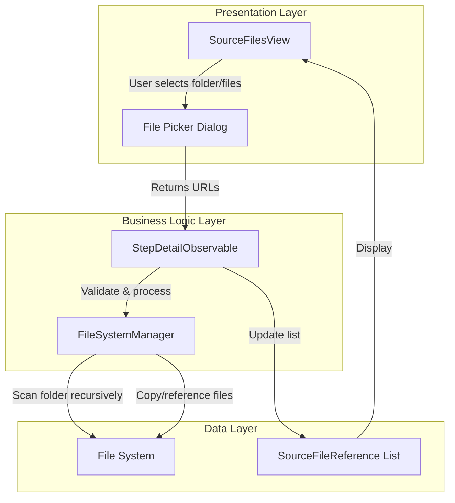

# Design Document: Source File Selection Improvement

## Overview

The Source File Selection Improvement feature enhances the AI Forge application's file selection workflow to support both individual file selection and bulk folder import for API documentation and code example files. The design separates the selection experience into two distinct workflows—one for API documentation and one for code examples—allowing users to efficiently organize hundreds of files without manual individual selection.

The feature integrates with the existing FileSystemManager to handle recursive folder scanning, file validation, and directory organization. It maintains backward compatibility with the current SourceFilesView while providing an improved user experience through clearer visual distinction, better guidance, and support for bulk operations.

**Key Design Principles:**
- **Separation of Concerns**: API documentation and code examples have distinct selection flows
- **Bulk Operations**: Support folder selection to handle large numbers of files efficiently
- **Clear Guidance**: Visual and textual cues help users understand file type requirements
- **Validation First**: Validate files and folders before adding to prevent errors downstream
- **Consistency**: Maintain alignment with existing AI Forge design patterns and SwiftUI best practices

## Architecture

### Component Interaction Diagram



### Data Flow

1. **User Initiates Selection**: User clicks "Add API Documentation" or "Add Code Examples" button
2. **File Picker Opens**: macOS file picker opens in folder/file selection mode with appropriate label
3. **User Selects**: User selects either a folder (for bulk import) or individual files
4. **Validation**: FileSystemManager validates the selection:
   - If folder: recursively scan for .swift files
   - If files: verify .swift extension and readability
5. **File Organization**: FileSystemManager copies/references files to appropriate directory:
   - API Documentation → `../api_training_data/`
   - Code Examples → `code_examples/`
6. **State Update**: StepDetailObservable updates the sourceFiles list with new SourceFileReference objects
7. **UI Refresh**: SourceFilesView displays updated file list with category distinction

## Components and Interfaces

### SourceFilesView (Enhanced)

The SourceFilesView is enhanced to provide separate selection workflows for each file category.

```swift
// Copyright ©2026 Big Mountain Studio. All rights reserved. X: @BigMtnStudio

import SwiftUI
import SwiftData
import UniformTypeIdentifiers

struct SourceFilesView: View {
    @Bindable var observable: StepDetailObservable
    @State private var showingAPIDocumentationPicker = false
    @State private var showingCodeExamplesPicker = false
    @State private var selectedPickerCategory: SourceFileCategory?
    
    var body: some View {
        VStack(alignment: .leading, spacing: 16) {
            helpSection
            
            if observable.sourceFiles.isEmpty {
                emptyStateView
            } else {
                fileListView
            }
        }
        .padding()
        .animation(.easeInOut(duration: 0.3), value: observable.sourceFiles.count)
        .fileImporter(
            isPresented: $showingAPIDocumentationPicker,
            allowedContentTypes: [.folder, .sourceCode, .plainText],
            allowsMultipleSelection: true
        ) { result in
            handleFileSelection(result, category: .apiDocumentation)
        }
        .fileImporter(
            isPresented: $showingCodeExamplesPicker,
            allowedContentTypes: [.folder, .sourceCode, .plainText],
            allowsMultipleSelection: true
        ) { result in
            handleFileSelection(result, category: .codeExamples)
        }
    }
    
    private var helpSection: some View {
        VStack(alignment: .leading, spacing: 8) {
            Text("Source Files")
                .font(.headline)
            
            Text("Add API documentation and code examples to generate training data. You can select individual files or entire folders.")
                .font(.subheadline)
                .foregroundStyle(.secondary)
            
            HStack(spacing: 16) {
                VStack(alignment: .leading, spacing: 4) {
                    Label("API Documentation", systemImage: "doc.text")
                        .font(.caption)
                        .fontWeight(.semibold)
                    
                    Text("Swift interface files with API definitions")
                        .font(.caption2)
                        .foregroundStyle(.secondary)
                }
                
                Divider()
                
                VStack(alignment: .leading, spacing: 4) {
                    Label("Code Examples", systemImage: "chevron.left.forwardslash.chevron.right")
                        .font(.caption)
                        .fontWeight(.semibold)
                    
                    Text("Complete working SwiftUI examples")
                        .font(.caption2)
                        .foregroundStyle(.secondary)
                }
            }
            .padding(8)
            .background(.regularMaterial, in: .rect(cornerRadius: 8))
        }
    }
    
    private var emptyStateView: some View {
        VStack(spacing: 16) {
            Image(systemName: "doc.badge.plus")
                .font(.system(size: 48))
                .foregroundStyle(.secondary)
                .symbolEffect(.pulse)
            
            Text("No Source Files")
                .font(.headline)
            
            Text("Add API documentation and code examples to begin")
                .font(.subheadline)
                .foregroundStyle(.secondary)
                .multilineTextAlignment(.center)
            
            HStack(spacing: 12) {
                Button {
                    showingAPIDocumentationPicker = true
                } label: {
                    Label("Add API Docs", systemImage: "doc.text.plus")
                }
                .buttonStyle(.bordered)
                
                Button {
                    showingCodeExamplesPicker = true
                } label: {
                    Label("Add Examples", systemImage: "chevron.left.forwardslash.chevron.right")
                }
                .buttonStyle(.bordered)
            }
        }
        .frame(maxWidth: .infinity)
        .padding()
        .transition(.opacity.combined(with: .scale))
    }
    
    private var fileListView: some View {
        VStack(alignment: .leading, spacing: 12) {
            let apiDocs = observable.sourceFiles.filter { $0.category == .apiDocumentation }
            let codeExamples = observable.sourceFiles.filter { $0.category == .codeExamples }
            
            if apiDocs.isEmpty == false {
                categorySection(title: "API Documentation", files: apiDocs, icon: "doc.text")
            }
            
            if codeExamples.isEmpty == false {
                categorySection(title: "Code Examples", files: codeExamples, icon: "chevron.left.forwardslash.chevron.right")
            }
            
            HStack(spacing: 12) {
                Button {
                    showingAPIDocumentationPicker = true
                } label: {
                    Label("Add API Docs", systemImage: "plus")
                }
                .buttonStyle(.bordered)
                
                Button {
                    showingCodeExamplesPicker = true
                } label: {
                    Label("Add Examples", systemImage: "plus")
                }
                .buttonStyle(.bordered)
            }
            .padding(.top, 8)
        }
    }
    
    private func categorySection(title: String, files: [SourceFileReference], icon: String) -> some View {
        VStack(alignment: .leading, spacing: 8) {
            HStack {
                Label(title, systemImage: icon)
                    .font(.subheadline)
                    .fontWeight(.semibold)
                
                Spacer()
                
                Text("\(files.count) file\(files.count == 1 ? "" : "s")")
                    .font(.caption)
                    .foregroundStyle(.secondary)
            }
            
            List {
                ForEach(files) { file in
                    HStack {
                        Image(systemName: icon)
                            .foregroundStyle(.blue)
                        
                        VStack(alignment: .leading, spacing: 2) {
                            Text(file.fileName)
                                .font(.body)
                            
                            HStack {
                                Text(file.viewFileSizeFormatted)
                                    .font(.caption)
                                    .foregroundStyle(.secondary)
                                
                                Text("•")
                                    .foregroundStyle(.secondary)
                                
                                Text(directoryPath(for: file.category))
                                    .font(.caption)
                                    .foregroundStyle(.secondary)
                            }
                        }
                        
                        Spacer()
                        
                        Button {
                            Task {
                                await observable.removeSourceFile(file)
                            }
                        } label: {
                            Image(systemName: "trash")
                                .foregroundStyle(.red)
                        }
                        .buttonStyle(.plain)
                        .accessibilityLabel("Delete \(file.fileName)")
                    }
                    .contextMenu {
                        Button(role: .destructive) {
                            Task {
                                await observable.removeSourceFile(file)
                            }
                        } label: {
                            Label("Delete", systemImage: "trash")
                        }
                    }
                    .transition(.opacity.combined(with: .move(edge: .leading)))
                }
            }
            .frame(minHeight: 100)
        }
    }
    
    private func directoryPath(for category: SourceFileCategory) -> String {
        switch category {
        case .apiDocumentation: return "../api_training_data/"
        case .codeExamples: return "code_examples/"
        }
    }
    
    private func handleFileSelection(_ result: Result<[URL], Error>, category: SourceFileCategory) {
        switch result {
        case .success(let urls):
            Task {
                await observable.addSourceFilesOrFolders(urls, category: category)
            }
        case .failure(let error):
            observable.errorMessage = "Failed to select files: \(error.localizedDescription)"
        }
    }
}

#Preview {
    let fileSystemManager = FileSystemManager()
    let pythonExecutor = PythonScriptExecutor()
    let workflowEngine = WorkflowEngineObservable(
        modelContext: ProjectModel.preview.mainContext,
        pythonExecutor: pythonExecutor,
        fileSystemManager: fileSystemManager
    )
    
    let observable = StepDetailObservable(
        workflowEngine: workflowEngine,
        fileSystemManager: fileSystemManager,
        pythonExecutor: pythonExecutor
    )
    
    SourceFilesView(observable: observable)
}
```

### StepDetailObservable (Enhanced)

The StepDetailObservable is enhanced with a new method to handle both file and folder selection.

```swift
// Enhanced method in StepDetailObservable

func addSourceFilesOrFolders(_ urls: [URL], category: SourceFileCategory) async {
    guard let project = currentProject else {
        errorMessage = "Cannot add source files: No project is currently loaded"
        return
    }
    
    let projectURL = URL(fileURLWithPath: project.projectDirectoryPath)
    var addedCount = 0
    var failedFiles: [String] = []
    
    for url in urls {
        let accessing = url.startAccessingSecurityScopedResource()
        defer {
            if accessing {
                url.stopAccessingSecurityScopedResource()
            }
        }
        
        do {
            // Check if URL is a directory
            var isDir: ObjCBool = false
            if FileManager.default.fileExists(atPath: url.path, isDirectory: &isDir), isDir.boolValue {
                // Process folder recursively
                let swiftFiles = try fileSystemManager.findSwiftFiles(in: url)
                for swiftFile in swiftFiles {
                    do {
                        let reference = try fileSystemManager.addSourceFile(
                            at: swiftFile,
                            to: projectURL,
                            category: category
                        )
                        sourceFiles.append(reference)
                        addedCount += 1
                    } catch {
                        failedFiles.append(swiftFile.lastPathComponent)
                    }
                }
            } else {
                // Process individual file
                let reference = try fileSystemManager.addSourceFile(
                    at: url,
                    to: projectURL,
                    category: category
                )
                sourceFiles.append(reference)
                addedCount += 1
            }
        } catch {
            failedFiles.append(url.lastPathComponent)
        }
    }
    
    // Update error message
    if addedCount > 0 {
        errorMessage = nil
        await loadSourceFiles()
    }
    
    if failedFiles.isEmpty == false {
        errorMessage = "Failed to add \(failedFiles.count) file(s): \(failedFiles.joined(separator: ", "))"
    }
}
```

### FileSystemManager (Enhanced)

The FileSystemManager is enhanced with a method to recursively find Swift files in a directory.

```swift
// Enhanced method in FileSystemManager

func findSwiftFiles(in directory: URL) throws -> [URL] {
    var swiftFiles: [URL] = []
    
    let fileManager = FileManager.default
    guard let enumerator = fileManager.enumerator(
        at: directory,
        includingPropertiesForKeys: [.isRegularFileKey],
        options: [.skipsHiddenFiles]
    ) else {
        throw FileSystemError.cannotEnumerateDirectory
    }
    
    for case let fileURL as URL in enumerator {
        do {
            let resourceValues = try fileURL.resourceValues(forKeys: [.isRegularFileKey])
            if resourceValues.isRegularFile == true && fileURL.pathExtension == "swift" {
                swiftFiles.append(fileURL)
            }
        } catch {
            // Skip files that cannot be accessed
            continue
        }
    }
    
    return swiftFiles
}
```

## Data Models

### SourceFileReference (No Changes)

The existing SourceFileReference model remains unchanged and continues to track individual files with their category assignment.

### SourceFileCategory (No Changes)

The existing SourceFileCategory enum remains unchanged:

```swift
enum SourceFileCategory: String, Codable {
    case apiDocumentation
    case codeExamples
}
```

## Error Handling

### File Selection Errors

- **Invalid File Type**: Display error if non-.swift files are selected
- **Folder Access Denied**: Display error if folder cannot be read
- **No Swift Files Found**: Display warning if folder contains no .swift files
- **Duplicate Files**: Display warning if file already exists in category

### Validation Errors

- **Empty Selection**: Prevent adding empty folders
- **File System Errors**: Display specific error messages for file system operations
- **Permission Errors**: Display error if files cannot be copied/referenced

## Testing Strategy

### Unit Testing

Unit tests should verify:
- File picker correctly filters for .swift files
- Folder recursion finds all .swift files in subdirectories
- File validation correctly identifies valid and invalid files
- Category assignment is correct for each file type
- Error messages are displayed for invalid selections
- File removal correctly deletes files from the file system

### Property-Based Testing

Property-based tests should verify:
- For any folder with .swift files, recursive scanning finds all files
- For any set of files added to a category, they all appear in the file list
- For any file removed, it no longer appears in the file list
- For any folder import, all discovered files are assigned the correct category
- Round-trip: adding then removing files leaves the system in the original state

### Integration Testing

Integration tests should verify:
- File picker integration with StepDetailObservable
- FileSystemManager correctly organizes files in directories
- SourceFilesView correctly displays files from both categories
- Step completion validation works with files from both categories
- Python scripts can locate and process organized files

## Correctness Properties

A property is a characteristic or behavior that should hold true across all valid executions of a system—essentially, a formal statement about what the system should do. Properties serve as the bridge between human-readable specifications and machine-verifiable correctness guarantees.

### Property-Based Testing Overview

Property-based testing (PBT) validates software correctness by testing universal properties across many generated inputs. Each property is a formal specification that should hold for all valid inputs.

### Core Principles

1. **Universal Quantification**: Every property must contain an explicit "for all" statement
2. **Requirements Traceability**: Each property must reference the requirements it validates
3. **Executable Specifications**: Properties must be implementable as automated tests
4. **Comprehensive Coverage**: Properties should cover all testable acceptance criteria

### Correctness Properties

Property 1: Recursive folder scanning discovers all Swift files
*For any* folder containing .swift files, when the FileSystemManager recursively scans the folder, it should discover all .swift files in the folder and its subdirectories.
**Validates: Requirements 1.6, 3.1, 3.2**

Property 2: Individual file selection adds only selected files
*For any* set of individual files selected by the user, when added to a category, only those files should appear in the sourceFiles list for that category.
**Validates: Requirements 1.7**

Property 3: File category assignment is correct
*For any* file or folder added through the API Documentation picker, the assigned category should be apiDocumentation. *For any* file or folder added through the Code Examples picker, the assigned category should be codeExamples.
**Validates: Requirements 1.8**

Property 4: API documentation files are placed in correct directory
*For any* API documentation file added to the system, the file should be located in the `../api_training_data/` directory.
**Validates: Requirements 2.4**

Property 5: Code example files are placed in correct directory
*For any* code example file added to the system, the file should be located in the `code_examples/` directory.
**Validates: Requirements 2.5**

Property 6: File extension validation rejects non-Swift files
*For any* file with a non-.swift extension, when the user attempts to add it, the FileSystemManager should reject it and display an error message.
**Validates: Requirements 3.3, 3.4, 3.5**

Property 7: Multiple files from folder are all added to same category
*For any* folder containing multiple .swift files, when the folder is added to a category, all discovered files should be added to that same category.
**Validates: Requirements 5.3**

Property 8: Files from different categories remain separate
*For any* set of files added to the API Documentation category and any set of files added to the Code Examples category, the two sets should remain in separate lists with no overlap.
**Validates: Requirements 5.4**

Property 9: File removal deletes file from file system
*For any* file in the sourceFiles list, when the user removes it, the file should be deleted from the file system and no longer appear in the sourceFiles list.
**Validates: Requirements 5.1, 5.2, 5.8**

Property 10: Empty category displays empty state
*For any* category that contains no files, when the SourceFilesView is rendered, it should display an empty state for that category.
**Validates: Requirements 5.7**

Property 11: Step completion requires at least one file
*For any* attempt to complete the Prepare Source Files step with zero files in all categories, the step completion should fail and display a validation error.
**Validates: Requirements 6.1, 6.2**

Property 12: Step completion allowed with files in one category
*For any* state where at least one file exists in at least one category, the Prepare Source Files step should be allowed to complete.
**Validates: Requirements 6.3, 6.4**

Property 13: Category information persists after step completion
*For any* set of files added before step completion, when the user returns to the Prepare Source Files step after completion, all files should still be present with their correct categories.
**Validates: Requirements 6.5, 6.6**

Property 14: File organization matches Python script expectations
*For any* set of files added to the system, the file system organization should match what the Python scripts (generate_optimized_dataset.py and generate_unified_dataset.py) expect: API documentation in `../api_training_data/` and code examples in `code_examples/`.
**Validates: Requirements 7.1, 7.2, 7.3, 7.5**

Property 15: UI updates immediately when file is removed
*For any* file in the sourceFiles list, when the user removes it, the SourceFilesView should update its display immediately to reflect the removal.
**Validates: Requirements 4.5**

